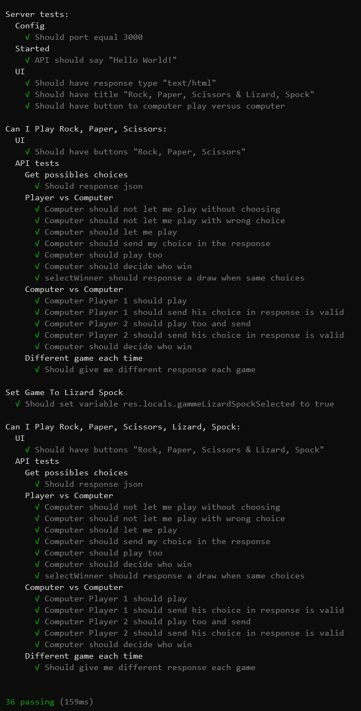
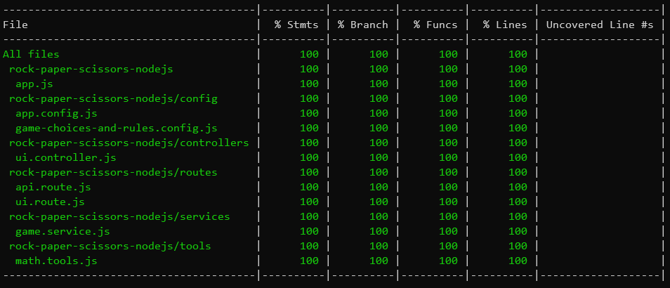

# Rock, Paper, Scissors & Lizard, Spock (Node.js)

version: 'v1.0.0'

## Description

For an interview, i was asked to dev this game with thoses users story:

- Front

  As a frequent games player,

  I'd like to play rock, paper, scissors

  So that I can spend an hour of my day havind fun

  Acceptance Criteria:

  - Can I play Player vs Computer?
  - Can I play Computer vs Computer?
  - Can I play a different game each time?

- Back

  Technical Constraints:

  - Doesn't neecessarilu need a flashy GUI (can be simple)
  - Use <s>PHP</s> _(Scala or Javascript)_
  - Libs / external modules should only be used for tests
  - Using best in industry agile engineering practices

Best if we use TDD, code cogerage, copy and paste detection, designs (DDD, or design patterns).

So, i tried to use my "code-sens" to doing my best in less than one day, starting from scratch.

You will find here, an example of TDD, with a lot of tests.

### Prepare your envionement

### Clone the project in your workspace

```bash
    $ git clone https://github.com/Stayfi/Winnr.git
```

### install dependencies

Go to the proeject directory and do

```bash
    $ npm install
```

### Start the project

```bash
    $ npm run start
```

Open your browser to : http://localhost:3000

### Running tests

```bash
    $ npm run test
```



### Running coverage

```bash
    $ npm run coverage
```



### Running copy/paste detection

```bash
    $ npm run jscpd
```


